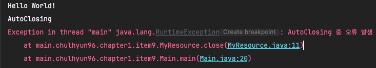
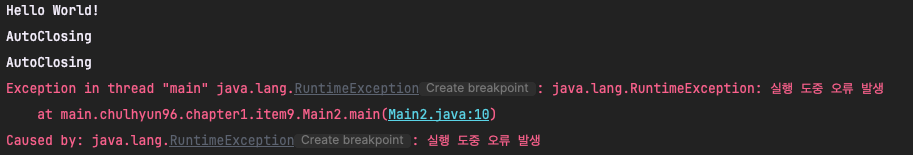

## Item9 : try - finally 보다는 try - with - resources 를 사용하라

---

## 서론

---
자바 라이브러리에는 `close` 메서드를 호출함으로써 직접적으로 자원을 닫아주는 것을 명시적으로 해줘야 하는 것들이 있다.
`InputStream`,`OutputStream`, `java.sql.Connection`등이 좋은 예이다.

자원 닫기는 개발자가 놓치기 쉬원 부분들이기 때문에 실수로 닫아주지 않을 경우 예측할 수 없는 성능 문제로 이어지기도 한다.

이로인해 자바 7부터 `try-with-resources` 부터 등장했다.

---

## 본론

---
`try - with - resources`를 사용하기 위해서는 자원을 반납하는 클래스 자체에 `AutoCloseable` 인터페이스를 구현해주면된다.
`try - with - resources`는 기존의 명시적으로 `close` 메서드를 호출함으로써 자원을 닫아주는 역할을 직접하지 않고 `AutoCloseable`이 해준다.

```java
public interface AutoCloseable {
    void close() throws Exception;
}

public class MyResource implements AutoCloseable {
    public void run() {
        System.out.println("Hello World!");
        throw new RuntimeException("실행 도중 오류 발생");
    }
    @Override
    public void close() throws Exception {
        System.out.println("AutoClosing");
        throw new RuntimeException("AutoClosing 중 오류 발생");
    }
}
```

해당 클래스를 구현 해놓고 `try-finally`와 `try-with-resources`의 차이점을 보자

```java
public class Main {
    public static void main(String[] args) throws Exception {
        MyResource myResource = null;
        try {
            myResource = new MyResource();
            myResource.run(); // -> 해당 부분 오류 발생
            MyResource resource = null;
            try {
                resource = new MyResource();
                resource.run(); // -> 해당 부분 오류 발생
            } finally {
                if (resource != null) {
                    resource.close(); // -> 자원을 닫아줌 (닫는 과정에 오류가 발생함)
                }
            }
        } finally {
            if (myResource != null) {
                myResource.close(); // -> 자원을 닫아줌 (닫는 과정에 오류가 발생함(
            }

        }
    }
}
```
`try - finally` 구문 사용시 만약 2개 이상의 자원관리 객체를 가져다 써야 할 경우 해당 자원관리 객체의 개수만큼 `try - finally` 구문을
사용해야한다. 2개인데 벌써 가독성이 현저히 많이 떨어진다.


그리고 위 사진처럼 예외가 발생한 곳은 run 부분이지만 finally 부분은 무조건 도달하는 부분이기 때문에 run 부분에 대한 예외는 사라지고
finally부분에서 발생한 예외만 남게된다 **즉 앞서 발생한 예외를 먹어버린다는 것**. 이 하나만으로도 자원을 관리하는 로직이 있다면 `try - finally` 보단 `try - with - resources`를 사용해야한다.


```java
public class Main2 {
    public static void main(String[] args) {
        try(MyResource  myResource1 = new MyResource();
            MyResource myResource2 = new MyResource()){
            myResource1.run();
            myResource2.run();
        } catch (RuntimeException e) {
            throw new RuntimeException(e);
        }
    }
}
```
try - with - resources는 명확하다. 코드도 눈에 잘 읽힌다.


그리고 앞서 run 메서드 실행 시 먼저 발생하는 예외에 대해서 먼저 출력한다. **즉 예외가 발생한 곳의 정확한 위치에서부터 예외메시지를 전달해준다는 것**
그리고 run 메서드 실행 시 예외가 발생하자 자원2개에 대해서 확실히 자원을 닫아주는 것을 볼 수 있다.

---

## 결론

---

close를 명시적으로 선언해줘야 하는 자바의 객체를 다룰 때는 try - with - resources를 사용하자.
정확한 예외 정보를 보여줄뿐 아니라 코드의 가독성 또한 올라간다.


