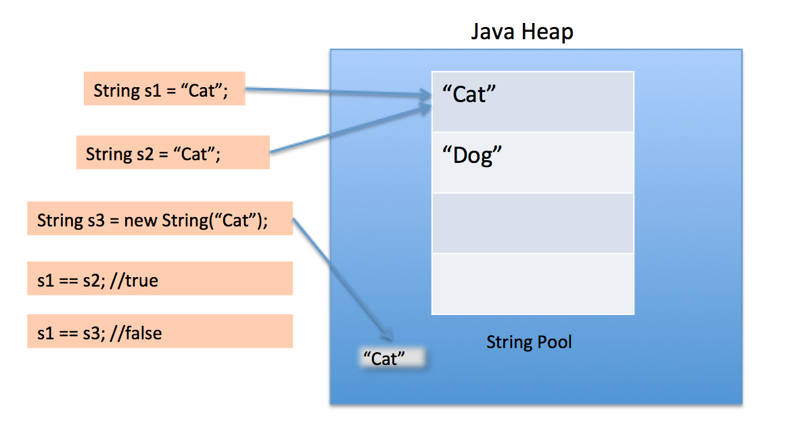

## 불필요한 객체 생성을 피하라
똑같은 기능의 객체를 매번 생성하기보다, 객체 하나를 재사용하는 편이 나을 때가 많다.
특히 불변 객체는 언제든 재사용될 수 있다.

#### 예시
```java
String s1 = "Cat";
String s2 = "Cat";
String s3 = new String("Cat"); // 하지 말아야 할 예시
```
자바에서는 문자열을 효율적으로 관리하기 위해 `String Pool`이라는 개념을 사용한다.
리터럴을 이용한 방식의 `String`은 `String Pool`에 들어가게 되는데,
`String Pool`에 같은 내용의 `String` 객체가 있다면(`String.intern()`) 그 객체를 참조하게 하여서 재사용할 수 있는데,
하지만 `String`을 `new`로 생성하면 `heap`영역에 항상 새로운 객체를 만들게 된다.


#### 정규표현식을 사용한 예시
만약 `ID`를 회원가입할 때, `ID`가 문자와 숫자를 포함해야 하는 조건이 있다면
```java
public boolean containsLettersAndNumbers(String s) {
    return s.matches("^(?=.*[A-Za-z])(?=.*\\d).+$"); // 내부적으로 Pattern.compile() 호출
}
```
이렇게 코드를 짤 수도 있다. 하지만 이 방식의 문제는 `String`의 `matches()` 메서드를 사용하는 데에 있다.
**`String.matches()`는 정규표현식으로 문자열 형태를 확인하는 가장 쉬운 방법이지만,
성능이 중요한 상황에서 반복해서 사용하기에는 적합하지 않다.**
내부에서 만드는 정규표현식용 `Pattern` 인스턴스는 한 번 쓰고 버려져 곧바로 가비지 컬렉션 대상이 된다.

#### 개선 예시
```java
import java.util.regex.Pattern;

private static final Pattern LETTER_AND_NUMBER = Pattern.compile("^(?=.*[A-Za-z])(?=.*\\d).+$");

public boolean containsLettersAndNumbers(String s) {
    return LETTER_AND_NUMBER.matcher(s).matches();
}
```
이렇게 코드를 짠다면 `containsLettersAndNumbers`가 빈번히 호출되는 상황에서 성능을 상당히 끌어올릴 수 있다.

### 오토박싱
불필요한 객체를 만들어내는 또 다른 예로 오토박싱(Auto Boxing)이 있다.
```java
public static void main(String[] args) {
    long startTime = System.currentTimeMillis();
    long sum = sum();
    long endTime = System.currentTimeMillis();
    System.out.println("sum = " + sum);
    System.out.println("time = " + (endTime - startTime));
}

private static long sum() {
    Long sum = 0L;
    for (int i = 0; i < Integer.MAX_VALUE; i++) {
        sum += i;
    }
    return sum;
}
```
```Console
sum = 2305843005992468481
time = 5005
```
위 메서드가 정확한 값을 주기는 하지만, 제대로 구현했을 때보다 훨씬 느리다. 겨우 오타 하나 때문에 그렇다.
sum 변수를 `long`이 아닌 `Long`으로 선언하면 불필요한 Long 인스턴스가 약 2<sup>31</sup>개나 만들어진다.
단순히 `sum`의 타입을 `long`으로 맞춰주기만 한다면,

```java
public static void main(String[] args) {
        long startTime = System.currentTimeMillis();
        long sum = sum();
        long endTime = System.currentTimeMillis();
        System.out.println("sum = " + sum);
        System.out.println("time = " + (endTime - startTime));
    }

    private static long sum() {
        long sum = 0L; // 타입 수정
        for (int i = 0; i < Integer.MAX_VALUE; i++) {
            sum += i;
        }
        return sum;
    }
```
```Console
sum = 2305843005992468481
time = 499
```
내 컴퓨터에서는 대략 10배가 빨라진다. 그러므로,
**박싱된 기본 타입보다는 기본 타입을 사용하고, 의도치 않은 오토박싱이 숨어들지 않도록 조심하자.**

### 결론
이번 아이템에서 "객체 생성은 비싸니 피해야 한다"로 오해하면 안 된다.
특히 요즘 JVM에서 별다른 일을 하지 않는 작은 객체를 생성하고 회수하는 일이 크게 부담되지 않는다.
프로그램의 명확성, 간결성 기능을 위해 객체를 추가로 생성하는 것이라면 일반적으로 좋다.

그리고, 아주 무거운 객체가 아닌 다음에야 단순히 객체 생성을 피하고자 자기들만의 객체 풀(Pool)을 만들지 말자.
일반적으로 자체 객체 풀은 코드를 헷갈리게 만들고 메모리 사용량을 늘리고 성능을 떨어뜨린다.